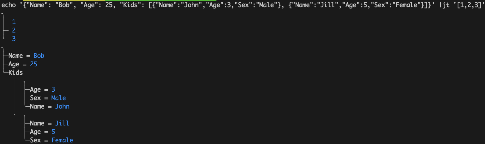
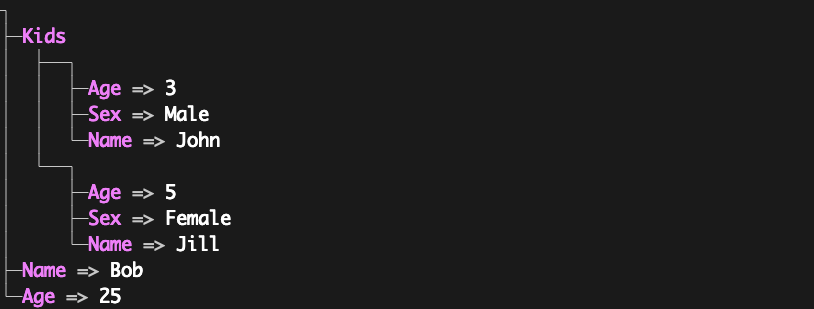
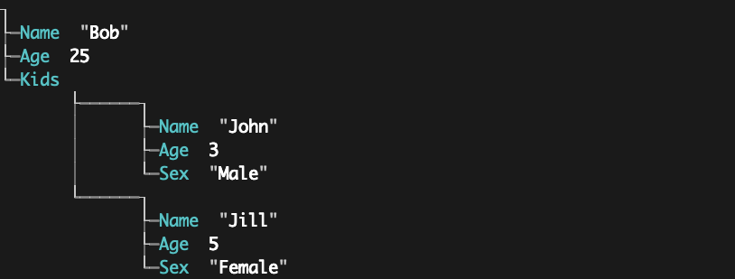
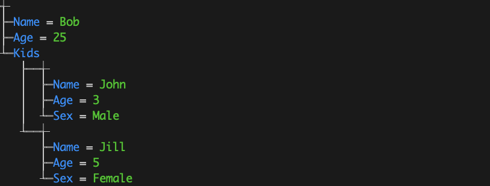

# jt

---
## json to tree

Convert json output to human readable tree

`alias jt="/usr/local/jt --quote=''  --value-colour=blue --style=5  --width=1"`

`jt test.json`


```console
Usage: jt [optional] [positional]

Print a json as a tree

optional arguments:
general style:
    --style=None
        line style
    --null-char=None
        value for empty array/dictionaries
    --quote="
        quoting character(s) (default ")
    --equals=:
        equals character(s) (default :)
    --width=1
        width of the tree (default 1)
key style:
    --key-colour=none
        key colour {red, green, yellow, blue, purple, magenta, cyan, white} (default none)
    --key-bold=false
        bold font
    --key-inverted=false
        inverted font
value style:
    --value-colour=none
        value colour {red, green, yellow, blue, purple, magenta, cyan, white} (default none)
    --value-bold=false
        bolt font
    --value-inverted=false
        inverted font
other style:
    --other-colour=none
        other colour {red, green, yellow, blue, purple, magenta, cyan, white} (default none)
    --other-bold=false
        bold font
    --other-inverted=false
        inverted font

positional arguments:
	json/file

stdin arguments:
	json
```

```
jt file.json
╮
├─faculties
│  ├──╮
│  │  ├─name : "Engineering"
│  │  ╰─departments
│  │     ├──╮
│  │     │  ├─name : "Computer Science"
│  │     │  ╰─programs
│  │     │     ├──╮
│  │     │     │  ├─name : "Artificial Intelligence"
│  │     │     │  ├─courses
│  │     │     │  │  ├──╮
│  │     │     │  │  │  ├─code : "AI101"
│  │     │     │  │  │  ├─name : "Introduction to AI"
│  │     │     │  │  │  ╰─topics
│  │     │     │  │  │     ├─ "Machine Learning"
│  │     │     │  │  │     ├─ "Neural Networks"
│  │     │     │  │  │     ╰─ "AI Ethics"
│  │     │     │  │  ╰──╮
│  │     │     │  │     ├─code : "AI202"
│  │     │     │  │     ├─name : "Advanced AI Techniques"
│  │     │     │  │     ├─topics
│  │     │     │  │     │  ├─ "Deep Learning"
│  │     │     │  │     │  ├─ "Reinforcement Learning"
│  │     │     │  │     │  ╰─ "Computer Vision"
│  │     │     │  │     ╰─prerequisites
│  │     │     │  │        ╰─ "AI101"
│  │     │     │  ╰─labs
│  │     │     │     ├──╮
│  │     │     │     │  ├─ "Lab1"
│  │     │     │     │  ├─ "Machine Learning Lab"
│  │     │     │     │  ╰──╮
│  │     │     │     │     ├─ "TensorFlow"
│  │     │     │     │     ╰─ "PyTorch"
│  │     │     │     ╰──╮
│  │     │     │        ├─ "Lab2"
│  │     │     │        ├─ "Robotics Lab"
│  │     │     │        ╰──╮
│  │     │     │           ├─ "ROS"
│  │     │     │           ╰─ "Gazebo"
│  │     │     ╰──╮
│  │     │        ├─name : "Software Engineering"
│  │     │        ╰─courses
│  │     │           ╰──╮
│  │     │              ├─code : "SE101"
│  │     │              ├─name : "Introduction to Software Engineering"
│  │     │              ╰─topics
│  │     │                 ├─ "Software Design"
│  │     │                 ├─ "Version Control"
│  │     │                 ╰─ "Testing"
│  │     ╰──╮
│  │        ├─name : "Electrical Engineering"
│  │        ╰─programs
│  │           ╰──╮
│  │              ├─name : "Circuit Design"
│  │              ╰─courses
│  │                 ╰──╮
│  │                    ├─topics
│  │                    │  ├─ "Analog Circuits"
│  │                    │  ├─ "Digital Circuits"
│  │                    │  ╰─ "PCB Design"
│  │                    ├─code : "CD101"
│  │                    ╰─name : "Basics of Circuit Design"
│  ╰──╮
│     ├─name : "Science"
│     ╰─departments
│        ╰──╮
│           ├─name : "Physics"
│           ╰─programs
│              ╰──╮
│                 ├─courses
│                 │  ╰──╮
│                 │     ├─code : "QM101"
│                 │     ├─name : "Introduction to Quantum Mechanics"
│                 │     ╰─topics
│                 │        ├─ "Wave Function"
│                 │        ├─ "Uncertainty Principle"
│                 │        ╰─ "Quantum Entanglement"
│                 ╰─name : "Quantum Mechanics"
├─research
│  ├─areas
│  │  ├─ "Sustainable Energy"
│  │  ├─ "Quantum Computing"
│  │  ╰─ "Nanotechnology"
│  ╰─projects
│     ╰──╮
│        ├─funding : "$2,000,000"
│        ├─objectives
│        │  ├─ "Develop quantum algorithms for energy optimization"
│        │  ╰─ "Prototype a quantum simulation for new materials"
│        ├─title : "Quantum Computing for Energy Solutions"
│        ╰─participants
│           ├──╮
│           │  ├─name : "Dr. Alan Turing"
│           │  ╰─role : "Lead Scientist"
│           ╰──╮
│              ├─name : "Dr. Lisa Meitner"
│              ╰─role : "Physicist"
├─university : "Global Science Institute"
├─location
│  ├─city : "Techville"
│  ╰─country : "Innovatia"
╰─free
   ╰─╯

 ```

```go
jt --equals='=>' --quote='' --key-colour=magenta --key-bold --value-colour=white --value-bold family.json
```



```go
jt --equals=''  --key-colour=cyan  --value-colour=white --value-bold --style=7 -width=5  family.json
```



```go
jt --equals='=' --quote='' --key-colour=blue  --value-colour=green --style=8 family.json
```



## Why?

A good json pretty printer for those just looking at the information or passing it on to a non-technical individual\
**There is a python version that was the driver for this
Great accent to `jq`

## How?
Renders out of order in style chosen

## What are the styles?
0-10 try them out or look at the code

## Improvements?
~~Testing on Linux and Windows~~

## State
- In Windows redirecting the text to file causes the special characters to be corrupted.  I thinkj this is some limitation in Windows?  If anyone know, file a bug

## Notes/Troubleshooting:

## New

### 1.0
Turn a json object into a human-readable tree

### 1.1 
Improved reliability on stdin, particularly when input comes from another application and is multiline
